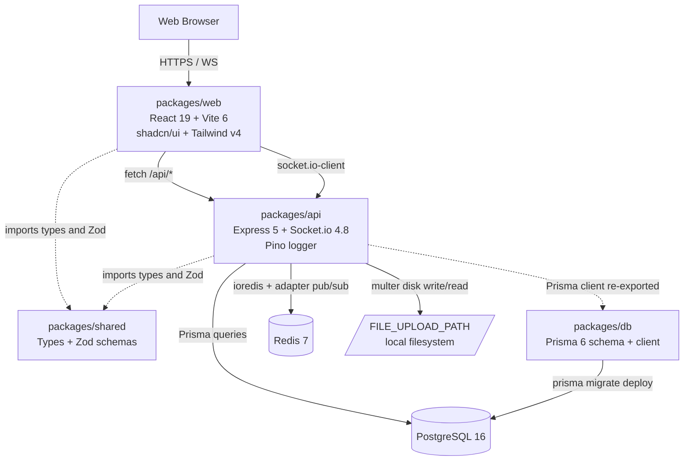

# Technical Specification

# 0. Agent Action Plan

## 0.1 Intent Clarification

### 0.1.1 Core Feature Objective

Based on the prompt, the Blitzy platform understands that the new feature requirement is to build a fully functional Slack clone web application from a greenfield repository, deliverable as a single-command local proof-of-concept runnable through `make local`. The product must visually and behaviorally mirror Slack's web UI (as captured in the 1,022 screenshots checked into `/screenshots/`) while implementing the following discrete capabilities end-to-end:

- **User authentication** — email + password registration and login, JWT-based session establishment, identity available across HTTP and WebSocket layers [packages/api/src/routes/auth.ts:POST /register, POST /login, GET /me].
- **Public and private channels** — create, list, join, leave; private channels restrict visibility and membership [packages/api/src/routes/channels.ts, packages/db/prisma/schema.prisma:Channel,ChannelMember].
- **Direct messages** — start a 1:1 DM between two users and exchange messages [packages/api/src/routes/dms.ts, packages/db/prisma/schema.prisma:DirectMessage,DMParticipant].
- **Real-time message delivery** — every new message, reaction, typing indicator, and presence change is pushed over Socket.io within sub-second latency [packages/api/src/sockets/handlers/*, packages/web/src/lib/socket.ts].
- **Message threads** — replies attached to a parent message via `Message.parentId` self-reference [packages/db/prisma/schema.prisma:Message, packages/api/src/routes/messages.ts:GET /:id/replies].
- **Emoji reactions** — toggle Unicode emoji reactions on any message; counts and reactors broadcast in real time [packages/db/prisma/schema.prisma:MessageReaction, packages/api/src/sockets/handlers/reaction.handler.ts].
- **File sharing with a 10 MB cap** — multipart upload through Express multer, file metadata persisted, attachment linked to message [packages/api/src/middleware/upload.ts, packages/api/src/routes/files.ts, packages/db/prisma/schema.prisma:File].
- **Full-text search** — PostgreSQL `tsvector` column on `Message.content` with a GIN index, ACL-filtered by the requesting user's channel and DM membership [packages/api/src/services/search.service.ts, packages/db/prisma/migrations/*].
- **User presence (online/away/offline)** — Redis-backed TTL heartbeat; status transitions broadcast over Socket.io [packages/api/src/services/presence.service.ts, packages/api/src/sockets/handlers/presence.handler.ts].
- **Message history pagination** — 50 messages per page, cursor-based, surfaced as infinite scroll in the UI [packages/api/src/routes/channels.ts:GET /:id/messages?cursor=&limit=50, packages/web/src/hooks/useMessages.ts].

### 0.1.2 Implicit Requirements Surfaced

The literal prompt does not enumerate the following requirements, yet each is necessary to satisfy the explicit objectives. They MUST therefore be treated as in-scope:

- **Docker Compose orchestration** for PostgreSQL 16 and Redis 7, with persistent volumes, so that `make local` can stand up databases on any developer machine [docker-compose.yml].
- **Prisma migration scripts** committed to `/packages/db/prisma/migrations/**` so that schema is reproducible and `make migrate` is deterministic.
- **Database seed mechanism that calls `/api/auth/register`** per Rule 4, packaged as `scripts/seed-via-api.ts` and invoked by `make seed` after the API is online.
- **Health-check endpoint** (`GET /api/health`) so that `make local` can block on API readiness before seeding and before opening the browser.
- **CORS middleware** on the API configured for the Vite dev server origin so that the web client can reach `localhost:3000` (or equivalent) from `localhost:5173` (or equivalent) [packages/api/src/app.ts].
- **Zod request and response validation** on 100% of API endpoints to satisfy Validation Gate 12 [packages/shared/src/schemas/*, packages/api/src/middleware/validate.ts].
- **Environment loader with Zod-validated schema** for `NODE_ENV`, `DATABASE_URL`, `REDIS_URL`, `JWT_SECRET`, `JWT_EXPIRES_IN`, `FILE_UPLOAD_PATH`, `MAX_FILE_SIZE_MB` [packages/api/src/config/env.ts].
- **Socket.io JWT handshake middleware** so that WebSocket connections are authenticated identically to HTTP routes [packages/api/src/middleware/socket-auth.ts].
- **Pino HTTP request-logging middleware** to satisfy the Observability requirement [packages/api/src/middleware/request-logger.ts].
- **Static file serving** for uploaded attachments so that `` and download links resolve [packages/api/src/routes/files.ts].
- **TypeScript `strict: true`, `noUnusedLocals`, `noUnusedParameters`** plus ESLint zero-warning configuration to enforce Rule 3 [tsconfig.base.json, .eslintrc.cjs].
- **pnpm workspace declaration** so that `pnpm install` from the root resolves all four packages [pnpm-workspace.yaml].
- **`/docs/decision-log.md`** as a CREATE file to satisfy the user-specified Explainability rule (decision log is the single source of truth for "why").
- **Playwright configuration and browser binaries** for the E2E test layer [playwright.config.ts].
- **Shared client state stores** for authentication and the presence map so that real-time updates rerender every subscriber [packages/web/src/stores/*.ts].
- **shadcn/ui CLI scaffolding** (`npx shadcn@latest init`) creating `components.json` and seeding `/packages/web/src/components/ui/` with the copy-paste primitives required by every page.

### 0.1.3 Special Instructions and Constraints

The prompt embeds five non-negotiable rules and the user-specified rules attachment adds one more. All six MUST be honored:

- **Rule 1 — Screenshot-Driven UI**: Every visible screen must visually align with the 1,022 PNGs under `/screenshots/Slack web Jul 2024 *.png`. Layout structure, color palette (dark aubergine sidebar, white content area), iconography, the `#` channel-name prefix, pill-chip reaction styling, three-column layout, and modal-overlay patterns are derived from those screenshots.
- **Rule 2 — Real-Time via WebSockets with Redis adapter**: All real-time updates traverse Socket.io. Polling is forbidden. Horizontal scalability is provided by `@socket.io/redis-adapter` against the Redis instance defined in `docker-compose.yml`.
- **Rule 3 — Zero-Warning Build**: TypeScript `strict: true`, ESLint emits zero warnings (`--max-warnings 0`), and `@ts-ignore` / `@ts-expect-error` are forbidden. The build pipeline fails on any TS or ESLint diagnostic.
- **Rule 4 — Test User Seed via Registration Flow**: The seed user `admin@test.com` / `Password12345!` is created by calling `POST /api/auth/register` (NOT by a direct database `INSERT`). The seed script is gated on API readiness.
- **Rule 5 — Makefile as Single Command Interface**: A root `Makefile` is the only command surface. `make local` performs end-to-end setup (Docker up → install → migrate → seed → start servers). `make build`, `make test`, `make lint`, `make migrate`, `make seed`, `make clean`, `make down` provide the remaining lifecycle.
- **Explainability (user-specified)**: Every non-trivial implementation decision MUST be documented in `/docs/decision-log.md` as a Markdown table with columns *what was decided*, *what alternatives existed*, *why this choice was made*, and *what risks it carries*. Rationale MUST NOT be embedded in code comments — the decision log is the single source of truth. Unexplained deviations from the prompt count as defects.

User examples preserved verbatim from the prompt:

- **User Example — Seed Credentials**: `admin@test.com` / `Password12345!`
- **User Example — Health endpoint contract**: `GET /api/health` returns readiness for Docker, Postgres, Redis, and the API.
- **User Example — Performance budgets**: `<500ms` message delivery, `<5s` presence propagation, `<1s` history load, `<2s` search, `<5s` file upload, `50` concurrent WebSocket sessions.
- **User Example — Coverage floor**: `≥80%` line coverage from Jest unit tests, plus Playwright golden-path and edge-case E2E.

### 0.1.4 Technical Interpretation

These feature requirements translate to the following technical implementation strategy:

- To deliver **authentication**, we will create `packages/api/src/routes/auth.ts` and `packages/api/src/services/auth.service.ts` to expose `POST /api/auth/register` (bcrypt-hash + insert + issue JWT), `POST /api/auth/login` (verify + issue JWT), and `GET /api/auth/me` (decode + return); validation is enforced by Zod schemas at `packages/shared/src/schemas/auth.ts`.
- To deliver **channels**, we will create `packages/api/src/routes/channels.ts` plus a corresponding service and the `Channel` / `ChannelMember` Prisma models; private channel ACL is enforced in the service layer before the Prisma query runs.
- To deliver **direct messages**, we will create `packages/api/src/routes/dms.ts` and the `DirectMessage` / `DMParticipant` Prisma models with a unique composite on the participant pair; the same `Message` model is reused so timeline behavior is identical to channels.
- To deliver **real-time delivery**, we will mount Socket.io on the same HTTP server in `packages/api/src/index.ts`, attach `@socket.io/redis-adapter` from `packages/api/src/config/redis.ts`, and register typed handlers under `packages/api/src/sockets/handlers/`; the web client constructs a singleton in `packages/web/src/lib/socket.ts` and subscribes via `packages/web/src/hooks/useSocket.ts`.
- To deliver **threads**, we will add a self-referencing `parentId` column to the `Message` model and a `GET /api/messages/:id/replies` route; the UI mounts a `Sheet`-based thread panel on the right of the channel view.
- To deliver **emoji reactions**, we will create the `MessageReaction` Prisma model with a composite unique on `(messageId, userId, emoji)` and route handlers that emit `reaction:added` / `reaction:removed` over Socket.io.
- To deliver **file sharing**, we will create `packages/api/src/middleware/upload.ts` using multer disk storage to `FILE_UPLOAD_PATH`, expose `POST /api/files` and `GET /api/files/:id`, and link `Message.fileId` so a message may carry one attachment up to `MAX_FILE_SIZE_MB`.
- To deliver **full-text search**, we will add a `tsvector` generated column on `Message.content` and a GIN index via a Prisma migration, then implement `GET /api/search?q=` in `packages/api/src/services/search.service.ts` using `prisma.$queryRaw` with ACL filtering.
- To deliver **presence**, we will create `packages/api/src/services/presence.service.ts` backed by Redis with TTL heartbeat (online when last seen < 60 s, away when < 5 min, otherwise offline) and broadcast `presence:update` events on transitions.
- To deliver **pagination**, we will use cursor-based pagination on `Message.createdAt + id` and surface it in the UI via `IntersectionObserver` in `packages/web/src/hooks/useMessages.ts`.
- To deliver the **screenshot-driven UI**, we will compose pages and components against `shadcn/ui` primitives copied into `packages/web/src/components/ui/`, styled with Tailwind CSS v4 tokens including a Slack-aubergine palette override in `packages/web/src/index.css`.
- To deliver the **single-command surface**, we will author a root `Makefile` whose `local` target chains Docker up, pnpm install, Prisma migrate, seed-via-api, and concurrently starting the API and web dev servers.
- To deliver **explainability**, we will create `/docs/decision-log.md` and require downstream agents to append a row whenever they make a non-trivial decision.

## 0.2 Repository Scope Discovery

### 0.2.1 Comprehensive Repository Analysis

The repository is confirmed to be in a **pre-implementation (greenfield) state**. A direct inventory of the working tree (excluding the `.git` metadata directory) returns only the following files and folders:

- `/README.md` — declares the project as "in early development" and that "currently contains only screenshots and planning materials" with "no code has been written yet" [README.md:L1-L4].
- `/catalog-info.yaml` — a Backstage `Component` descriptor naming the service `blitzy-slack` with `lifecycle: experimental` and tags `[new-feature, proof-of-concept, typescript, web-app]` [catalog-info.yaml:metadata.tags].
- `/mkdocs.yml` — minimal MkDocs configuration with `site_name: 'blitzy-slack'`, a single `Home: index.md` nav entry, and the `techdocs-core` + `mermaid2` plugins [mkdocs.yml:site_name].
- `/docs/index.md` — a single-line description: "blitzy-slack — Slack integration sandbox exploring AI-assisted communication platform development" [docs/index.md:L1].
- `/screenshots/Slack web Jul 2024 0.png` through `/screenshots/Slack web Jul 2024 1021.png` — **1,022 reference PNG screenshots** of the Slack web UI captured in July 2024, sized between ~220 KB and ~920 KB each, serving as the visual specification for Rule 1.

There is **no `package.json`, `Makefile`, `Dockerfile`, `docker-compose.yml`, `tsconfig.json`, source directory, test directory, ESLint config, Prettier config, Prisma schema, environment template, or any other implementation artifact** anywhere in the working tree. Consequently, every implementation file enumerated by this Agent Action Plan is a **CREATE** operation. The only exceptions are:

| Path | Mode | Reason |
|------|------|--------|
| `/README.md` | MODIFY | Replace stub content with quickstart, architecture summary, and Make-target reference table |
| `/docs/index.md` | MODIFY (optional) | Refresh from sandbox blurb to a brief PoC project description; safe to leave untouched |
| `/mkdocs.yml` | UNCHANGED (optional MODIFY) | May add new nav entries if additional docs are authored; not required by prompt |
| `/catalog-info.yaml` | UNCHANGED | Backstage descriptor remains valid as-is |
| `/screenshots/**` | REFERENCE | Read-only inputs cited by the UI implementation; MUST NOT be deleted or rewritten |

Integration-point discovery in a greenfield repository reduces to defining the **target** integration surface (rather than discovering an existing one). The target integrations are:

- **Web → API**: HTTP REST under `/api/*` and Socket.io WebSocket at the root path, both exposed by `packages/api`.
- **API → PostgreSQL**: Prisma Client constructed once in `packages/api/src/config/` and reused via dependency injection through service modules.
- **API → Redis**: `ioredis` clients — one for the Socket.io adapter and one for the presence cache.
- **API → Filesystem**: multer disk storage writing to `FILE_UPLOAD_PATH`; Express static serving the same directory for reads.
- **Web ↔ Shared**: type and Zod schema imports.
- **API ↔ Shared**: type and Zod schema imports.
- **API ↔ DB package**: Prisma Client and generated types re-exported from `packages/db/src/index.ts`.

### 0.2.2 Web Search Research Conducted

The following research was conducted to resolve "Latest stable" version pins and to catalog the shadcn/ui + Tailwind CSS design system per the Design System Alignment Protocol:

- **Latest stable Socket.io version** — confirmed as 4.8.3 (released December 2025) from the official Socket.IO documentation site.
- **Tailwind CSS v4 architecture** — confirmed that v4.x ships an `@theme` directive, an OKLCH-based default palette, dynamic spacing scale derived from `--spacing: 0.25rem`, and a Vite plugin (`@tailwindcss/vite`); v4.2 introduced four additional color palettes (mauve, olive, mist, taupe).
- **shadcn/ui component catalog** — verified at the official documentation site; relevant primitives include Accordion, Alert, Alert Dialog, Avatar, Badge, Button, Card, Command, Dialog, Dropdown Menu, Form, Input, Label, Popover, Scroll Area, Separator, Sheet, Skeleton, Sonner (toasts), Tabs, Textarea, Tooltip, Spinner, Item, Empty — plus the 2025 additions Button Group, Input Group, Field, Kbd.
- **Prisma 6 system requirements** — confirmed minimum Node.js 22.11.0 and TypeScript 5.1.0 are required by Prisma 6; both are satisfied by the prompt's Node 22 LTS and TypeScript 5.7+ floors.
- **Best practices for JWT-authenticated Socket.io handshakes** — confirmed the recommended pattern: pass the token through `socket.handshake.auth`, verify in an `io.use((socket, next) => …)` middleware, attach the decoded identity to `socket.data` or `socket.user`.
- **Best practices for PostgreSQL full-text search via Prisma** — confirmed Prisma 6's `fullTextSearchPostgres` preview feature for type-safe access; raw `tsvector` with GIN index is the production-grade fallback.

No additional research is required: all version pins and design-system tokens necessary for downstream code generation have been resolved.

### 0.2.3 New File Requirements

Every implementation file is a CREATE. The catalog below groups files by package; complete wildcarded inventory is enumerated in §0.7.

**Root workspace files (greenfield additions):**

- `Makefile` — single command interface per Rule 5
- `docker-compose.yml` — Postgres 16 + Redis 7 services with volumes
- `pnpm-workspace.yaml` — declares `packages/*` workspaces
- `package.json` — root manifest with workspace scripts and shared devDependencies
- `tsconfig.base.json` — strict TS config with `noUnusedLocals` and `noUnusedParameters` per Rule 3
- `.eslintrc.cjs` (or `eslint.config.js`) — zero-warning lint config per Rule 3
- `.prettierrc`, `.gitignore`, `.nvmrc`, `.env.example`
- `playwright.config.ts` — E2E configuration
- `scripts/seed-via-api.ts` — Rule 4 seed mechanism
- `docs/decision-log.md` — Explainability rule requirement

**`packages/db` files:** `package.json`, `tsconfig.json`, `prisma/schema.prisma`, `prisma/migrations/**`, `prisma/seed.ts`, `src/client.ts`, `src/index.ts`.

**`packages/shared` files:** `package.json`, `tsconfig.json`, `src/index.ts`, `src/types/{user,channel,message,dm,presence,socket-events}.ts`, `src/schemas/{auth,channel,message,dm}.ts`, `src/constants/{events,limits}.ts`.

**`packages/api` files:** `package.json`, `tsconfig.json`, `.env.example`, `src/index.ts`, `src/app.ts`, `src/config/{env,logger,redis}.ts`, `src/middleware/{auth,socket-auth,error-handler,request-logger,validate,upload}.ts`, `src/routes/{auth,channels,messages,dms,files,search,health,index}.ts`, `src/services/{auth,channels,messages,dms,files,search,presence}.service.ts`, `src/sockets/index.ts`, `src/sockets/handlers/{message,presence,reaction,channel}.handler.ts`, `src/sockets/rooms.ts`, `test/{auth,channels,messages,dms,files,search,socket}.test.ts`, `test/setup.ts`.

**`packages/web` files:** `package.json`, `tsconfig.json`, `vite.config.ts`, `tailwind.config.ts` (or v4 CSS-based theme), `postcss.config.js`, `components.json`, `index.html`, `.env.example`, `src/main.tsx`, `src/App.tsx`, `src/router.tsx`, `src/index.css`, `src/pages/{Landing,Register,Login,Workspace,Channel,DirectMessage,Thread,SearchResults}.tsx`, `src/components/ui/**` (shadcn-generated), `src/components/{layout,channels,messages,dms,presence,files,search}/**`, `src/hooks/**`, `src/lib/{api-client,socket,utils}.ts`, `src/stores/{auth,presence}.store.ts`, `test/e2e/{registration,messaging,dms,file-upload,search,screenshot-fidelity}.spec.ts`.

## 0.3 Dependency Inventory

### 0.3.1 Public Package Additions

Every entry below is a NEW addition; there are no existing dependencies to update because the repository is greenfield (no `package.json` is present at the time of authoring). Versions are pinned to the exact values resolved during research, where the prompt's "Latest stable" pins are concretized.

**Root workspace (devDependencies):**

| Registry | Name | Version | Purpose |
|----------|------|---------|---------|
| npm | `typescript` | `^5.7.0` | TypeScript compiler — prompt floor |
| npm | `@types/node` | `^22.0.0` | Node.js 22 LTS type definitions |
| npm | `eslint` | `^9.0.0` | Lint engine for zero-warning enforcement (Rule 3) |
| npm | `@typescript-eslint/eslint-plugin` | `^8.0.0` | TS-aware lint rules |
| npm | `@typescript-eslint/parser` | `^8.0.0` | TS parser for ESLint |
| npm | `prettier` | `^3.0.0` | Code formatting |
| npm | `@playwright/test` | `^1.49.0` | E2E test runner per Gates 8, 13 |
| npm | `concurrently` | `^9.0.0` | Run multiple dev servers from `make local` |
| npm | `tsx` | `^4.0.0` | Run TS scripts (seed-via-api.ts) without precompile |
| npm | `dotenv-cli` | `^7.0.0` | Inject env files into npm scripts |

**`packages/db` dependencies:**

| Registry | Name | Version | Purpose |
|----------|------|---------|---------|
| npm | `@prisma/client` | `^6.0.0` | Generated Prisma runtime — prompt requires Prisma 6.x |
| npm | `prisma` | `^6.0.0` | Prisma CLI (devDependency) for migrate, generate, studio |

**`packages/shared` dependencies:**

| Registry | Name | Version | Purpose |
|----------|------|---------|---------|
| npm | `zod` | `^3.23.0` | Runtime validation primitives consumed by both api and web |

**`packages/api` dependencies:**

| Registry | Name | Version | Purpose |
|----------|------|---------|---------|
| npm | `express` | `^5.0.0` | HTTP server framework — prompt requires Express 5.x |
| npm | `socket.io` | `^4.8.0` | WebSocket server — `Latest stable` resolved to 4.8.3 (December 2025) |
| npm | `@socket.io/redis-adapter` | `^8.3.0` | Cross-instance pub/sub for Socket.io (Rule 2) |
| npm | `ioredis` | `^5.4.0` | Redis client for the Socket.io adapter and presence cache |
| npm | `@prisma/client` | `^6.0.0` | Prisma runtime imported via `packages/db` |
| npm | `jsonwebtoken` | `^9.0.0` | JWT issuance and verification |
| npm | `bcrypt` | `^5.1.0` | Password hashing (native; alternative `bcryptjs` noted in decision log) |
| npm | `multer` | `^1.4.5-lts.1` | Multipart file uploads with `MAX_FILE_SIZE_MB` cap |
| npm | `cors` | `^2.8.5` | CORS middleware for the Vite dev origin |
| npm | `helmet` | `^8.0.0` | Standard security headers |
| npm | `pino` | `^9.0.0` | Structured logging — prompt-mandated |
| npm | `pino-http` | `^10.0.0` | Request logging middleware |
| npm | `pino-pretty` | `^11.0.0` | Pretty log output in dev (devDependency) |
| npm | `zod` | `^3.23.0` | Validation (re-exported via `packages/shared`) |
| npm | `dotenv` | `^16.0.0` | `.env` loading at process start |
| npm | `jest` | `^29.7.0` | Unit test runner — prompt requirement |
| npm | `ts-jest` | `^29.2.0` | TypeScript preprocessor for Jest (devDependency) |
| npm | `supertest` | `^7.0.0` | HTTP assertions in route tests (devDependency) |
| npm | `@types/express` | `^5.0.0` | Express 5 type definitions |
| npm | `@types/jsonwebtoken` | `^9.0.0` | JWT type definitions |
| npm | `@types/bcrypt` | `^5.0.0` | bcrypt type definitions |
| npm | `@types/multer` | `^1.4.0` | multer type definitions |
| npm | `@types/cors` | `^2.8.0` | cors type definitions |

**`packages/web` dependencies:**

| Registry | Name | Version | Purpose |
|----------|------|---------|---------|
| npm | `react` | `^19.0.0` | UI library — prompt requires React 19+ |
| npm | `react-dom` | `^19.0.0` | DOM renderer |
| npm | `react-router` | `^7.0.0` | Client routing (React 19 compatible) |
| npm | `socket.io-client` | `^4.8.0` | WebSocket client — `Latest stable` resolved to 4.8.3 |
| npm | `@tanstack/react-query` | `^5.0.0` | Server-state cache for channels, messages, search |
| npm | `zustand` | `^5.0.0` | Auth + presence client store |
| npm | `zod` | `^3.23.0` | Schemas shared with API |
| npm | `tailwindcss` | `^4.0.0` | Utility-first CSS — `Latest stable` resolved to v4.x |
| npm | `@tailwindcss/vite` | `^4.0.0` | Tailwind v4 Vite plugin |
| npm | `class-variance-authority` | `^0.7.0` | Variant management for shadcn components |
| npm | `clsx` | `^2.0.0` | Conditional class composition |
| npm | `tailwind-merge` | `^2.0.0` | Tailwind class deduplication |
| npm | `lucide-react` | `^0.460.0` | Icon set used by shadcn/ui |
| npm | `@radix-ui/react-*` | latest matching shadcn add | Headless primitives behind shadcn components |
| npm | `sonner` | `^1.7.0` | Toast notifications |
| npm | `react-hook-form` | `^7.50.0` | Form state |
| npm | `@hookform/resolvers` | `^3.9.0` | Zod resolver for react-hook-form |
| npm | `date-fns` | `^4.0.0` | Date formatting for message timestamps |
| npm | `vite` | `^6.0.0` | Build tool — prompt requires Vite 6+ |
| npm | `@vitejs/plugin-react` | `^4.3.0` | React Fast Refresh in Vite |
| npm | `@types/react` | `^19.0.0` | React 19 type definitions |
| npm | `@types/react-dom` | `^19.0.0` | React DOM 19 type definitions |
| npm | `@playwright/test` | `^1.49.0` | Per-package E2E spec discovery |

**Non-runtime tooling (executed via `npx`, not committed to `dependencies`):**

| Source | Name | Version | Purpose |
|--------|------|---------|---------|
| npx | `shadcn` | latest | Component generator CLI (`npx shadcn@latest init` and `add`) — copies source into `packages/web/src/components/ui/` |
| pnpm | `pnpm` | `>=9.0.0` | Workspace package manager (Corepack-managed) |

**Docker images (declared in `docker-compose.yml`):**

| Image | Tag | Purpose |
|-------|-----|---------|
| `postgres` | `16-alpine` | Primary database — prompt requires PostgreSQL 16 |
| `redis` | `7-alpine` | Pub/sub adapter + presence cache — prompt requires Redis 7.x |

### 0.3.2 Version Sourcing Notes

- All "Latest stable" pins in the prompt are resolved here against the May 27, 2026 research baseline. Specifically: `socket.io` and `socket.io-client` resolve to the 4.8.x line (4.8.3 confirmed at the time of authoring), `tailwindcss` resolves to the v4.x line, and `pino` / `zod` / `@tanstack/react-query` resolve to their respective current major lines.
- Prisma 6 requires Node.js ≥ 22.11.0 and TypeScript ≥ 5.1.0; both floors are exceeded by the prompt's Node 22 LTS and TypeScript 5.7+ requirements.
- `multer` is pinned to its `1.4.5-lts.1` line for production stability; if `multer` 2.x is verified compatible with Express 5 at scaffolding time, the upgrade SHOULD be recorded in the decision log.
- `bcrypt` (native) is the default; `bcryptjs` (pure JS) is the documented fallback for portability concerns and is captured in the decision log seed.

### 0.3.3 Dependency Updates and Imports

Because the repository contains no source code today, there are no import or external-reference updates to apply. All dependencies in §0.3.1 are *additions*. The first authored `package.json` files in each workspace package will declare these dependencies fresh; no migration of existing imports is required.

## 0.4 Integration Analysis

### 0.4.1 Greenfield Integration Topology

Because no source code exists, the "Integration Analysis" describes the integration surface that this implementation will construct, not modifications to a pre-existing one. The diagram below names every external system and every cross-package wire that the implementation MUST instantiate:

### 0.4.2 Cross-Package Wiring Points

Every wiring point below is a CREATE in greenfield:

- `packages/api/src/index.ts` — boots the HTTP server, attaches Socket.io, wires the Redis adapter, registers route modules, and starts listening on the API port.
- `packages/api/src/app.ts` — Express app factory composing helmet → cors → pino-http → JSON body parser → route mounts → error handler.
- `packages/api/src/config/env.ts` — loads `process.env` via `dotenv` and validates the full env shape with Zod (fails fast on missing `DATABASE_URL`, `REDIS_URL`, `JWT_SECRET`, `JWT_EXPIRES_IN`, `FILE_UPLOAD_PATH`, `MAX_FILE_SIZE_MB`).
- `packages/api/src/config/redis.ts` — constructs two `ioredis` clients (pub + sub) for the Socket.io adapter via `createAdapter(pub, sub)`, plus a third client for presence reads/writes.
- `packages/api/src/sockets/index.ts` — applies the JWT handshake middleware (`io.use((socket, next) => verifyJwt(socket.handshake.auth.token, ...))`) and registers each handler factory.
- `packages/web/src/main.tsx` — root `createRoot` render with `BrowserRouter` → `QueryClientProvider` → `AuthProvider`.
- `packages/web/src/lib/api-client.ts` — `fetch` wrapper that prepends `VITE_API_URL`, injects `Authorization: Bearer <jwt>`, and surfaces typed responses.
- `packages/web/src/lib/socket.ts` — singleton `io(VITE_WS_URL, { auth: { token } })`; reconnect logic guarded by Zustand auth state.

### 0.4.3 Workspace Dependency Graph

`pnpm-workspace.yaml` declares `packages/*`. The dependency edges between workspace packages are:

- `packages/web` depends on `packages/shared` for types and schemas.
- `packages/api` depends on `packages/shared` for types and schemas, and on `packages/db` for the Prisma client.
- `packages/db` depends on `packages/shared` for any cross-cutting type re-exports.
- `packages/shared` is a leaf package — it imports nothing from the workspace, minimizing coupling and preventing circular dependencies.

### 0.4.4 Database and Schema Touchpoints

All database schema is established via Prisma migrations. The initial migration provisions the following models with their key columns and constraints:

- `User` — `id` (cuid), `email` (unique), `passwordHash`, `displayName`, `avatarUrl?`, `createdAt`, `updatedAt`.
- `Channel` — `id`, `name` (unique), `description?`, `isPrivate`, `createdById` (FK→User), `createdAt`.
- `ChannelMember` — `id`, `channelId` (FK), `userId` (FK), `role`, `joinedAt`; unique composite on `(channelId, userId)`.
- `DirectMessage` — `id`, `createdAt`; with a join table `DMParticipant(dmId, userId)` and a unique constraint enforcing distinct pairs.
- `Message` — `id`, `content`, `authorId` (FK→User), `channelId?` (FK→Channel), `dmId?` (FK→DirectMessage), `parentId?` (self-FK for threads), `fileId?` (FK→File), `createdAt`, `updatedAt`; indexed on `createdAt` for cursor pagination.
- `MessageReaction` — `id`, `messageId` (FK), `userId` (FK), `emoji`; unique composite on `(messageId, userId, emoji)`.
- `File` — `id`, `originalName`, `storedName`, `mimeType`, `sizeBytes`, `uploadedById` (FK→User), `createdAt`.

A follow-up migration adds a generated `tsvector` column on `Message.content` plus a GIN index for full-text search; this is gated behind Prisma 6's `fullTextSearchPostgres` preview feature (or implemented via raw SQL in a custom migration if the preview is not enabled).

### 0.4.5 Real-Time Event Contract

The Socket.io event surface is declared once in `packages/shared/src/types/socket-events.ts` so that both client and server import the same typed interfaces:

- **Client → Server**: `message:send`, `typing:start`, `typing:stop`, `presence:heartbeat`, `channel:join`, `channel:leave`.
- **Server → Client**: `message:new`, `message:updated`, `reaction:added`, `reaction:removed`, `presence:update`, `typing:start`, `typing:stop`, `error`.

Rooms keyed `channel:<id>`, `dm:<id>`, `thread:<parentId>`, and `user:<id>` segment broadcasts. The Redis adapter ensures that emissions from any API instance reach subscribers connected to any other instance.

## 0.5 Design System Compliance

### 0.5.1 System Identification

Two design-system inputs are specified by the prompt and MUST be combined:

| Attribute | Value |
|-----------|-------|
| Component library | **shadcn/ui** |
| Status | to-be-added (no `package.json` present in the greenfield repo) |
| Distribution model | Copy-paste source files via the `shadcn` CLI (NOT a runtime npm dependency) |
| Source of truth | https://ui.shadcn.com/docs/components |
| Pinning mechanism | `components.json` at `packages/web/components.json` and the registry referenced therein |
| Initial install command | `npx shadcn@latest init` followed by `npx shadcn@latest add <component>` per primitive needed |

| Attribute | Value |
|-----------|-------|
| CSS framework | **Tailwind CSS** |
| Version | v4.x (latest stable line) |
| Package | `tailwindcss` and `@tailwindcss/vite` |
| Source of truth | https://tailwindcss.com/docs/theme |
| Key v4 features used | `@theme` directive in CSS, OKLCH color palette with 11 steps (50–950), dynamic spacing scale derived from `--spacing: 0.25rem`, native cascade layers |

The shadcn/ui distribution model is intentionally a copy-paste workflow: components are emitted as source files under `packages/web/src/components/ui/` and are owned by this codebase. This is a non-trivial decision that the Explainability decision log MUST record, including the trade-off that future shadcn upgrades require re-running the CLI per component rather than a single `npm update`.

### 0.5.2 Component Mapping

The mapping below cites the specific `shadcn/ui` component (by exact import name and path) that MUST be used for each UI element derived from the screenshots. Raw HTML elements MUST NOT be used where a shadcn primitive exists.

| UI Element | Library Component | Import Path | Props / Variant | Notes |
|------------|-------------------|-------------|------------------|-------|
| Primary action button (Send, Create, Sign In) | `Button` | `@/components/ui/button` | `variant="default"` | Default = filled |
| Secondary action button | `Button` | `@/components/ui/button` | `variant="secondary"` | |
| Destructive action (Leave channel) | `Button` | `@/components/ui/button` | `variant="destructive"` | |
| Ghost icon button (toolbar) | `Button` | `@/components/ui/button` | `variant="ghost" size="icon"` | |
| Text input (email, password, channel name) | `Input` | `@/components/ui/input` | `type="text" / "email" / "password"` | |
| Form label | `Label` | `@/components/ui/label` | — | Pairs with Input via htmlFor |
| Form wrapper (register, login, create channel) | `Form` | `@/components/ui/form` | `react-hook-form` + `zodResolver` | |
| Message composer body | `Textarea` | `@/components/ui/textarea` | autosize via class | Rich-text behavior overlaid in MessageComposer |
| User avatar (sidebar, message list) | `Avatar`, `AvatarImage`, `AvatarFallback` | `@/components/ui/avatar` | size via wrapper class | |
| Unread count, member count, presence dot wrapper | `Badge` | `@/components/ui/badge` | `variant="default" / "secondary"` | |
| Empty channel state card | `Card`, `CardHeader`, `CardContent` | `@/components/ui/card` | — | Pairs with `Empty` for "Welcome to #channel" |
| Empty-state primitive | `Empty` | `@/components/ui/empty` | — | shadcn 2025 addition |
| List row (channel list, DM list) | `Item`, `ItemMedia`, `ItemContent`, `ItemTitle` | `@/components/ui/item` | — | shadcn 2025 addition; composes Avatar + Badge |
| Create-channel modal, invite-sent modal (screenshot 500) | `Dialog`, `DialogContent`, `DialogHeader`, `DialogTitle`, `DialogFooter` | `@/components/ui/dialog` | — | Centered overlay matches Slack modal pattern |
| Thread side panel | `Sheet`, `SheetContent` | `@/components/ui/sheet` | `side="right"` | |
| Workspace switcher menu, profile menu, message overflow menu | `DropdownMenu`, `DropdownMenuTrigger`, `DropdownMenuContent`, `DropdownMenuItem` | `@/components/ui/dropdown-menu` | — | |
| Channel list scroll, message timeline scroll | `ScrollArea` | `@/components/ui/scroll-area` | — | |
| Sidebar section divider | `Separator` | `@/components/ui/separator` | `orientation="horizontal"` | |
| Search results category tabs | `Tabs`, `TabsList`, `TabsTrigger`, `TabsContent` | `@/components/ui/tabs` | — | |
| Icon hover hint (Huddle, Canvas icons) | `Tooltip`, `TooltipTrigger`, `TooltipContent` | `@/components/ui/tooltip` | — | |
| Emoji picker container | `Popover`, `PopoverTrigger`, `PopoverContent` | `@/components/ui/popover` | — | Wraps a custom emoji grid (GAP — see §0.5.4) |
| Quick switcher (Ctrl+K style) | `Command`, `CommandInput`, `CommandList`, `CommandItem` | `@/components/ui/command` | — | |
| Toast notifications (uploaded, error) | `Toaster` (via `sonner`) | `@/components/ui/sonner` | — | |
| Loading skeletons in message list | `Skeleton` | `@/components/ui/skeleton` | — | |
| Disconnection banner | `Alert`, `AlertTitle`, `AlertDescription` | `@/components/ui/alert` | `variant="destructive"` | |
| Submit-button spinner | `Spinner` | `@/components/ui/spinner` | — | shadcn 2025 addition |

Layout primitives in shadcn/ui itself are intentionally minimal — Tailwind utility classes (`flex`, `grid`, `gap-*`, `space-y-*`, `space-x-*`) MUST be applied directly to `div` containers for layout, since shadcn does not ship Flex / Stack / Grid components.

### 0.5.3 Token Mapping

The web package extends Tailwind v4's default theme with Slack-specific overrides in `packages/web/src/index.css` using the `@theme` directive. The token mapping below resolves the screenshot-derived design values to the system tokens that downstream agents MUST use.

| Category | Slack Reference Value | System Token | Resolution |
|----------|----------------------|--------------|------------|
| Color | Dark aubergine sidebar `~#3F0E40` | `--color-sidebar-bg` (custom @theme token) | Snap to OKLCH-tuned aubergine; record exact OKLCH value in decision log |
| Color | White content background | `--color-background` / `oklch(1 0 0)` | Exact (shadcn default light) |
| Color | Active-channel lavender `~#1164A3` accent | `--color-primary` (custom @theme override) | Snap; shadcn default primary replaced |
| Color | Hover background in sidebar | `--color-sidebar-hover` | Custom; derived from sidebar-bg lightened |
| Color | Text on aubergine (light gray) | `--color-sidebar-foreground` | Custom |
| Color | Default body text | `--color-foreground` (shadcn default) | Exact match |
| Color | Subtle dividers | `--color-border` (shadcn default) | Exact match |
| Color | Error / destructive | `--color-destructive` (shadcn default) | Exact match |
| Spacing | 4 px / 8 px / 12 px / 16 px / 24 px grid | `--spacing: 0.25rem` × scale (Tailwind v4 default) | Exact — Tailwind v4 dynamically derives any positive multiplier |
| Typography | UI font stack | `--font-sans` (default `ui-sans-serif, system-ui, sans-serif, ...`) | Exact (shadcn / Tailwind default) |
| Typography | Monospaced (code blocks) | `--font-mono` (default) | Exact |
| Type scale | Channel name h3 | `text-base` / `font-semibold` | Exact via Tailwind defaults |
| Type scale | Message body | `text-sm` / `font-normal` | Exact |
| Type scale | Timestamp / meta | `text-xs` / `text-muted-foreground` | Exact |
| Radius | Rounded reaction chip | `rounded-full` | Exact |
| Radius | Card / dialog corners | `--radius` → `rounded-lg` / `rounded-md` | Exact (shadcn default) |
| Shadow | Modal elevation | `shadow-xl` | Exact |
| Shadow | Dropdown menu elevation | `shadow-md` | Exact |
| Z-index | Modal overlay | `z-50` (Tailwind default) | Exact |

Every CSS value emitted by the web package MUST resolve to one of the tokens above or to a Tailwind utility that references them. Hardcoded hex codes, pixel values, or color literals in component code are forbidden by Rule 3 and Rule 1 compliance — only `0`, `none`, `auto`, `inherit`, `currentColor`, and `transparent` are permitted as bare CSS values.

### 0.5.4 Gaps Inventory

The shadcn/ui catalog does not provide direct equivalents for the following Slack UI elements visible in the reference screenshots. Each gap is paired with the proposed resolution:

| Gap | Visible In | Resolution |
|-----|-----------|------------|
| Emoji picker grid | Composer toolbar, message hover-reaction | Wrap a custom emoji grid (data via `emojibase` or `emoji-mart`) inside `Popover` from shadcn. Record this composite as a project-local component at `packages/web/src/components/messages/EmojiPicker.tsx`. |
| Rich-text editor (Bold, Italic, Code blocks, lists) | Message composer rich-text formatting toolbar | Layer Tiptap (or Lexical) inside a shadcn `Textarea`-styled container. Record as `packages/web/src/components/messages/RichTextEditor.tsx`. Flag for design-system extension. |
| File / image preview tile | Attached image messages, file cards | Compose a custom preview using `Card` + `Skeleton` + image element. Record as `packages/web/src/components/files/FilePreview.tsx`. |
| Three-column app layout (workspace nav | sidebar | content) | Every authenticated page | Custom `AppShell` composed of three `
` containers styled with Tailwind utility classes (`flex`, `flex-col`, `w-`, custom theme color tokens). |
| Slack-specific channel/DM list row | Sidebar channel list | Compose with shadcn `Item` + `Avatar` + `Badge` primitives. Record the composition pattern in the decision log. |
| Workspace nav rail (vertical icon column) | Far-left column in every authenticated screenshot | Compose with `Button variant="ghost" size="icon"` + `Tooltip`. |
| Typing indicator ("Alice is typing…") | Composer / message timeline foot | Custom small component using `text-xs` `text-muted-foreground` and the dynamic dots animation. |

No gap requires a third-party UI library beyond what is already declared in §0.3.

### 0.5.5 Compliance Summary

shadcn/ui supplies the overwhelming majority of UI primitives required for the PoC: button, input, textarea, label, form, avatar, badge, card, dialog, sheet, dropdown menu, scroll area, separator, tabs, tooltip, popover, command, sonner toast, skeleton, alert, spinner, item, and empty cover the entire authentication, channel, DM, message, search, and modal surface. Tailwind CSS v4 provides the layout primitives via utility classes and the design token namespace (`@theme`) for the Slack aubergine palette override. Seven gaps are documented in §0.5.4, each with a specific resolution that uses shadcn primitives as the substrate — none require deviation from the design system. The `shadcn` CLI itself is the only "to-be-added" tool, invoked via `npx`; Tailwind v4 is added as a runtime dependency in §0.3. No additional design-system dependencies are required.

## 0.6 Technical Implementation

### 0.6.1 File-by-File Execution Plan

Every file below is grouped by execution scope. The default mode is CREATE unless explicitly annotated otherwise.

**Group 1 — Workspace foundation (root):**

- CREATE `/Makefile` — implements `local`, `build`, `test`, `lint`, `migrate`, `seed`, `down`, `clean` targets per Rule 5; `local` chains `docker compose up -d` → `pnpm install` → `pnpm --filter @app/db prisma migrate deploy` → `make seed` (gated on `/api/health`) → `concurrently` to start API and web dev servers.
- CREATE `/docker-compose.yml` — declares `postgres:16-alpine` and `redis:7-alpine` services with named volumes; healthchecks gate `docker compose up --wait`.
- CREATE `/pnpm-workspace.yaml` — declares `packages/*`.
- CREATE `/package.json` — root manifest with `engines.node >=22.0.0`, `engines.pnpm >=9.0.0`, root scripts (`lint`, `format`, `test:e2e`) and shared devDependencies.
- CREATE `/tsconfig.base.json` — `strict: true`, `noUnusedLocals: true`, `noUnusedParameters: true`, `noFallthroughCasesInSwitch: true`, `forceConsistentCasingInFileNames: true`, `module: NodeNext`, `target: ES2022`.
- CREATE `/.eslintrc.cjs` (or `eslint.config.js`) — extends `@typescript-eslint/recommended-type-checked`; `--max-warnings 0` is enforced in the `lint` script per Rule 3.
- CREATE `/.prettierrc`, `/.gitignore`, `/.nvmrc`, `/.env.example`.
- CREATE `/playwright.config.ts` — Chromium + Firefox + WebKit projects, baseURL `VITE_APP_URL`, global setup that calls the seed script.
- CREATE `/scripts/seed-via-api.ts` — uses `fetch` to POST `admin@test.com` / `Password12345!` to `${API_URL}/api/auth/register`; idempotent (treats 409 conflict as success).
- MODIFY `/README.md` — replace the existing stub with a quickstart (`make local`), an architecture diagram link, a make-target reference table, and a section pointing to `/docs/decision-log.md`.
- CREATE `/docs/decision-log.md` — Markdown table with columns *Decision*, *Alternatives*, *Why*, *Risks*; seeded with the entries enumerated in §0.6.3.
- UNCHANGED `/catalog-info.yaml`, `/mkdocs.yml`, `/docs/index.md`, `/screenshots/**`.

**Group 2 — Database package (`packages/db`):**

- CREATE `package.json`, `tsconfig.json` (extends `tsconfig.base.json`).
- CREATE `prisma/schema.prisma` — datasource `postgresql`; generator `prisma-client-js`; models per §0.4.4; enables `previewFeatures = ["fullTextSearchPostgres"]` if used.
- CREATE `prisma/migrations/**/*` — generated by `prisma migrate dev --name init` then `--name add_message_tsvector`.
- CREATE `prisma/seed.ts` — delegates to `scripts/seed-via-api.ts` per Rule 4; MUST NOT issue direct DB inserts.
- CREATE `src/client.ts` — singleton `PrismaClient` with `log: ['warn', 'error']` and a graceful shutdown hook.
- CREATE `src/index.ts` — re-exports `PrismaClient`, generated model types, and the singleton instance.

**Group 3 — Shared package (`packages/shared`):**

- CREATE `package.json`, `tsconfig.json`.
- CREATE `src/index.ts` — barrel re-export.
- CREATE `src/types/{user,channel,message,dm,presence,socket-events}.ts` — DTOs and Socket.io `ClientToServerEvents` / `ServerToClientEvents` interfaces.
- CREATE `src/schemas/{auth,channel,message,dm}.ts` — Zod schemas: `registerSchema`, `loginSchema`, `createChannelSchema`, `joinChannelSchema`, `sendMessageSchema`, `reactionSchema`, `searchQuerySchema`, `startDmSchema`.
- CREATE `src/constants/events.ts` — string constants for every Socket.io event name.
- CREATE `src/constants/limits.ts` — `PAGE_SIZE = 50`, `MAX_FILE_SIZE_MB = 10`, `HEARTBEAT_INTERVAL_MS = 30_000`, `AWAY_THRESHOLD_MS = 300_000`.

**Group 4 — API package (`packages/api`):**

- CREATE `package.json`, `tsconfig.json`, `.env.example`.
- CREATE `src/index.ts` — composes the HTTP server, attaches Socket.io, plugs the Redis adapter, then `server.listen()`.
- CREATE `src/app.ts` — Express factory: helmet → cors → pino-http → JSON parser → router → error-handler.
- CREATE `src/config/{env,logger,redis}.ts` — Zod-validated env loader, Pino logger singleton, ioredis pub/sub clients.
- CREATE `src/middleware/{auth,socket-auth,error-handler,request-logger,validate,upload}.ts` — JWT verification (HTTP + WS), centralized error formatting, Pino HTTP, Zod request validator factory, multer disk storage.
- CREATE `src/routes/{auth,channels,messages,dms,files,search,health,index}.ts` — endpoint surfaces enumerated in §0.6.2.
- CREATE `src/services/{auth,channels,messages,dms,files,search,presence}.service.ts` — business logic; the only layer permitted to touch Prisma and Redis directly.
- CREATE `src/sockets/index.ts` — JWT handshake middleware, then registers each handler factory.
- CREATE `src/sockets/handlers/{message,presence,reaction,channel}.handler.ts` — one file per event family.
- CREATE `src/sockets/rooms.ts` — helpers for `channel:<id>`, `dm:<id>`, `thread:<parentId>`, `user:<id>` room keys.
- CREATE `test/{auth,channels,messages,dms,files,search,socket}.test.ts` plus `test/setup.ts` — Jest suites that hit the API with `supertest` and the Socket.io client.

**Group 5 — Web package (`packages/web`):**

- CREATE `package.json`, `tsconfig.json`, `vite.config.ts`, `tailwind.config.ts` (or v4 `@theme` in `src/index.css`), `postcss.config.js`, `components.json` (shadcn manifest), `index.html`, `.env.example`.
- CREATE `src/main.tsx` — `createRoot` + `BrowserRouter` + `QueryClientProvider` + `AuthProvider`.
- CREATE `src/App.tsx`, `src/router.tsx`, `src/index.css` (Tailwind directives + `@theme` Slack overrides).
- CREATE `src/pages/{Landing,Register,Login,Workspace,Channel,DirectMessage,Thread,SearchResults}.tsx`.
- CREATE `src/components/ui/**/*.tsx` — generated by `npx shadcn@latest add` for each primitive in §0.5.2.
- CREATE `src/components/{layout,channels,messages,dms,presence,files,search}/**/*.tsx` — domain components composed from `ui/*` primitives.
- CREATE `src/hooks/{useSocket,useAuth,useChannels,useMessages,usePresence,useTyping}.ts`.
- CREATE `src/lib/{api-client,socket,utils}.ts`.
- CREATE `src/stores/{auth,presence}.store.ts`.
- CREATE `test/e2e/{registration,messaging,dms,file-upload,search,screenshot-fidelity}.spec.ts`.

### 0.6.2 Implementation Approach per Package

**Root and tooling.** The Makefile is the single command surface and MUST NOT be bypassed. `make local` orchestrates: (a) `docker compose up -d --wait` so Postgres + Redis pass healthchecks, (b) `pnpm install --frozen-lockfile` when a lockfile exists, (c) `pnpm --filter @app/db exec prisma migrate deploy`, (d) `pnpm --filter @app/api dev &` then poll `/api/health` until 200, (e) `pnpm tsx scripts/seed-via-api.ts` per Rule 4, (f) `pnpm --filter @app/web dev` for the Vite server. `make test` runs `pnpm --filter ... test` (Jest) plus `pnpm exec playwright test`. `make lint` runs `eslint --max-warnings 0` per Rule 3.

**`packages/db`.** The Prisma schema is authored as the source of truth for the relational model. Two migrations are committed: an `init` migration provisioning all tables and indexes, and an `add_message_tsvector` migration introducing the generated `tsvector` column and the GIN index. The seed entry point (`prisma/seed.ts`) delegates to `scripts/seed-via-api.ts` per Rule 4, never issuing direct INSERT statements.

**`packages/shared`.** A zero-runtime module that exports the contracts both client and server share. Every Zod schema doubles as both the API request validator (via the `validate` middleware) and the form validator (via `@hookform/resolvers/zod`), enforcing identical rules on both sides of the wire.

**`packages/api`.** Routes → services → Prisma/Redis is the only permitted flow. Every route calls `validate(schema)` before invoking the service, attaches the authenticated user via `requireAuth`, and emits the appropriate Socket.io event after a successful mutation. Socket.io is mounted on the same HTTP server as Express; the Redis adapter ensures any emitter on any API instance reaches subscribers on any other instance per Rule 2. Presence is computed from Redis TTL — `online` for last-seen < 60 s, `away` for < 5 min, `offline` thereafter — with transitions broadcast as `presence:update`. Full-text search uses a `tsvector` column over `Message.content`, ACL-filtered in the service so that users only see hits from channels they belong to or DMs they participate in. File upload is multer disk storage to `FILE_UPLOAD_PATH` with the size cap from `MAX_FILE_SIZE_MB`; downloads are served via Express static. Every layer logs through Pino: request entry, business event, socket emit, error.

**`packages/web`.** React Router 7 owns routing. The authenticated shell is a three-column layout matching the screenshots: workspace icon rail | sidebar (channels / DMs sections) | main content. shadcn primitives are copied into `src/components/ui/`; domain components (`MessageList`, `MessageComposer`, `ChannelList`, `DmList`, `ThreadPanel`, `EmojiPicker`, `RichTextEditor`, `FilePreview`, `PresenceIndicator`, `ReactionChip`, `ReactionPicker`) compose those primitives. TanStack Query caches server data; Zustand owns auth state and the live presence map. The Socket.io singleton in `src/lib/socket.ts` subscribes once and dispatches incoming events into the TanStack Query cache via `queryClient.setQueryData` so that every subscriber rerenders instantly. Forms use `react-hook-form` with `zodResolver` against the same schemas the API validates. The Vite dev server runs on a different port than the API, with CORS allowed on the API side.

**Tests.** Jest covers ≥ 80 % of api/services and shared/schemas (Gate 13). Playwright covers golden-path E2E (register → login → create channel → send message → receive message in real time → react → reply in thread → upload file → search → logout) plus edge cases (invalid JWT, oversized file, disconnect + reconnect, expired session). A dedicated screenshot-fidelity suite under `packages/web/test/e2e/screenshot-fidelity.spec.ts` uses Playwright's `toHaveScreenshot` to verify visual alignment with the reference screenshots (Gate 8).

### 0.6.3 User Interface Design

The screen list is derived directly from the reference screenshots and the in-scope feature set. Each screen cites the screenshot(s) that establish its layout.

| Route | Component | Reference Screenshot(s) | Description |
|-------|-----------|-------------------------|-------------|
| `/` | `Landing.tsx` | `screenshots/Slack web Jul 2024 0.png` | Marketing landing with Sign In / Get Started CTAs |
| `/register` | `Register.tsx` | `screenshots/Slack web Jul 2024 1.png`, `screenshots/Slack web Jul 2024 8.png` | Email + password registration, optional displayName |
| `/login` | `Login.tsx` | `screenshots/Slack web Jul 2024 1.png` | Email + password login |
| `/app` (default redirect → first channel) | `Workspace.tsx` | `screenshots/Slack web Jul 2024 29.png` | Authenticated three-column shell |
| `/app/channels/:channelId` | `Channel.tsx` | `screenshots/Slack web Jul 2024 29.png`, `screenshots/Slack web Jul 2024 100.png` | Channel header + message timeline + composer |
| `/app/dms/:dmId` | `DirectMessage.tsx` | `screenshots/Slack web Jul 2024 100.png` (DMs panel) | 1:1 DM view, same composer pattern |
| `/app/threads/:messageId` (rendered as `Sheet` overlay) | `Thread.tsx` | `screenshots/Slack web Jul 2024 29.png` (right panel) | Thread replies panel |
| `/app/search` | `SearchResults.tsx` | `screenshots/Slack web Jul 2024 100.png` (search bar) | Search results grouped by channel |
| (Modal) `CreateChannelDialog`, `InviteSentDialog` | n/a | `screenshots/Slack web Jul 2024 500.png` | Centered modal overlay with backdrop |

Key user interactions that downstream agents MUST implement:

- **Composer**: `Enter` submits the message; `Shift+Enter` inserts a newline; `:` opens the emoji `Popover`; `@` opens the user-mention `Popover`. The paperclip button or a drag-drop zone opens the file picker.
- **Reactions**: clicking the smiley icon on a message hover opens the emoji `Popover`; clicking an existing reaction chip toggles the current user's reaction (add if absent, remove if present).
- **Threads**: clicking "Reply in thread" on any message opens the right-hand `Sheet`; the `Sheet` subscribes to the `thread:<parentId>` Socket.io room until closed.
- **Presence**: each `Avatar` shows a colored dot (green online, yellow away, gray offline) bound to `usePresence` for the rendered user id.
- **Infinite scroll**: `IntersectionObserver` at the top of `MessageList` triggers `loadOlder()` with the oldest visible message's cursor; loader displays a shadcn `Skeleton`.
- **File upload**: progress feedback via shadcn `Sonner` toast (uploaded / failed).
- **Search**: debounced input fires `GET /api/search?q=`; results render with shadcn `Tabs` grouping (Messages / Channels / Files); each hit links to the originating channel and scroll-anchors to the message.

The decision log seeds with these initial entries that downstream agents MUST populate as they implement:

- shadcn/ui copy-paste model vs. an npm component dependency.
- bcrypt (native) vs. bcryptjs (pure JS) — portability decision.
- Zustand vs. React Context vs. Redux Toolkit for client state.
- React Router 7 vs. TanStack Router.
- Cursor-based vs. offset pagination on `Message.createdAt`.
- PostgreSQL `tsvector` vs. trigram vs. external search engine.
- `@socket.io/redis-adapter` vs. a custom Redis pub/sub.
- multer 1.x LTS vs. multer 2.x against Express 5.
- Local filesystem storage vs. object storage (noted as production-only follow-up).

## 0.7 Scope Boundaries

### 0.7.1 Exhaustively In Scope

Every path below is in scope for CREATE (or, where annotated, MODIFY). Wildcards group folder-tree members.

**Root workspace and tooling:**

- `/Makefile`
- `/docker-compose.yml`
- `/pnpm-workspace.yaml`
- `/package.json`
- `/tsconfig.base.json`
- `/.eslintrc.cjs` (or `/eslint.config.js`)
- `/.prettierrc`, `/.gitignore`, `/.nvmrc`, `/.env.example`
- `/playwright.config.ts`
- `/scripts/seed-via-api.ts`
- `/README.md` *(MODIFY — replace stub with quickstart, architecture summary, Make-target reference)*
- `/docs/decision-log.md` *(CREATE — required by the Explainability rule)*
- `/docs/index.md` *(MODIFY optional)*

**Database package — all of `/packages/db/`:**

- `/packages/db/package.json`, `/packages/db/tsconfig.json`
- `/packages/db/prisma/schema.prisma`
- `/packages/db/prisma/migrations/**/*` *(Prisma-generated, committed to source)*
- `/packages/db/prisma/seed.ts`
- `/packages/db/src/**/*.ts`

**Shared package — all of `/packages/shared/`:**

- `/packages/shared/package.json`, `/packages/shared/tsconfig.json`
- `/packages/shared/src/**/*.ts` *(`index.ts`, `types/**`, `schemas/**`, `constants/**`)*

**API package — all of `/packages/api/`:**

- `/packages/api/package.json`, `/packages/api/tsconfig.json`, `/packages/api/.env.example`
- `/packages/api/src/index.ts`, `/packages/api/src/app.ts`
- `/packages/api/src/config/**/*.ts`
- `/packages/api/src/middleware/**/*.ts`
- `/packages/api/src/routes/**/*.ts`
- `/packages/api/src/services/**/*.ts`
- `/packages/api/src/sockets/**/*.ts`
- `/packages/api/test/**/*.test.ts`

**Web package — all of `/packages/web/`:**

- `/packages/web/package.json`, `/packages/web/tsconfig.json`, `/packages/web/.env.example`
- `/packages/web/vite.config.ts`, `/packages/web/postcss.config.js`, `/packages/web/components.json`
- `/packages/web/tailwind.config.ts` *(or Tailwind v4 `@theme` block in `src/index.css`)*
- `/packages/web/index.html`
- `/packages/web/src/main.tsx`, `/packages/web/src/App.tsx`, `/packages/web/src/router.tsx`, `/packages/web/src/index.css`
- `/packages/web/src/pages/**/*.tsx`
- `/packages/web/src/components/ui/**/*.tsx` *(shadcn-generated copies)*
- `/packages/web/src/components/layout/**/*.tsx`
- `/packages/web/src/components/channels/**/*.tsx`
- `/packages/web/src/components/messages/**/*.tsx`
- `/packages/web/src/components/dms/**/*.tsx`
- `/packages/web/src/components/presence/**/*.tsx`
- `/packages/web/src/components/files/**/*.tsx`
- `/packages/web/src/components/search/**/*.tsx`
- `/packages/web/src/hooks/**/*.ts`
- `/packages/web/src/lib/**/*.ts`
- `/packages/web/src/stores/**/*.ts`
- `/packages/web/test/e2e/**/*.spec.ts`

**Environment variables required (per Gate 12):**

- `NODE_ENV`, `DATABASE_URL`, `REDIS_URL`, `JWT_SECRET`, `JWT_EXPIRES_IN`, `FILE_UPLOAD_PATH`, `MAX_FILE_SIZE_MB`, `VITE_API_URL`, `VITE_WS_URL`

**Reference inputs (read-only — MUST NOT be modified):**

- `/screenshots/Slack web Jul 2024 0.png` … `/screenshots/Slack web Jul 2024 1021.png` *(1,022 PNGs — REFERENCE only)*
- `/catalog-info.yaml` *(UNCHANGED)*
- `/mkdocs.yml` *(UNCHANGED unless docs nav is expanded)*

### 0.7.2 Explicitly Out of Scope

The following items mirror the prompt's exclusions and additional implicit out-of-scope concerns. They MUST NOT be implemented:

- **AI / LLM features** — no chatbots, no smart-reply suggestions, no AI summarization.
- **Mobile applications** — no iOS, Android, or React Native targets.
- **Voice and video** — no Huddles, Clips, screen-share, or any audio/video media.
- **SSO / SAML / OAuth providers** — only email + password JWT authentication.
- **Admin panel and workspace administration UI** — no role-based admin views beyond the implicit owner.
- **Push notifications** — neither web push nor mobile push.
- **Message scheduling, pinning, or saving for later.**
- **Custom emoji upload** — only standard Unicode emoji.
- **Profile editing** — `displayName` and `avatarUrl` are captured at registration only; later edits are out of scope.
- **Message edit and delete** — messages are immutable once sent.
- **Multi-workspace support** — single implicit workspace for the PoC.
- **Billing, plans, integrations marketplace.**
- **Advanced search filters** (by date, by channel, by author) — only basic text query.
- **Read receipts and detailed delivery status.**
- **E2E / message-level encryption.**
- **Object storage backends (S3, GCS)** — local filesystem only.
- **Production deployment artifacts** — no CI/CD pipelines, no Kubernetes manifests, no Terraform, no Helm charts.
- **Load testing beyond the 50 concurrent WebSocket target** specified by the prompt.
- **Refactoring or modification of any existing file** other than `/README.md` (and optionally `/docs/index.md`, `/mkdocs.yml`).
- **Implementation of any Slack feature visible in `screenshots/` that is NOT in §0.7.1's feature list** — including but not limited to Lists, Canvas, Workflow Builder, Apps marketplace, Slack Connect, Huddle, Clips, Pro / Business+ tier features. These appear in the reference screenshots because Mobbin captured the full Slack web product; they are intentionally excluded from this PoC.
- **The 1,022 reference screenshots themselves** — they are read-only inputs and MUST NOT be deleted, moved, renamed, edited, or re-encoded.

## 0.8 Rules for Feature Addition

### 0.8.1 Embedded Prompt Rules

The prompt explicitly enumerates five non-negotiable rules. Each is preserved here verbatim with the implementation obligation it imposes:

- **Rule 1 — Screenshot-Driven UI**. The 1,022 PNGs under `/screenshots/Slack web Jul 2024 *.png` are the authoritative visual specification. Implemented screens MUST reproduce the layout structure (three columns: workspace nav | sidebar | content), color language (dark aubergine sidebar, white content), iconography, `#` channel prefix, pill-chip reactions, rich-text composer, modal overlay pattern, and Today / date separators observed in the screenshots. Where a screenshot depicts a feature not in §0.7.1's in-scope list (Lists, Canvas, Huddles, Apps, etc.), that feature MUST NOT be implemented even though it is visible.

- **Rule 2 — Real-Time via WebSockets with Redis adapter**. All real-time updates traverse Socket.io. HTTP polling is forbidden. The `@socket.io/redis-adapter` package MUST be wired in `packages/api/src/config/redis.ts` and attached to the Socket.io server in `packages/api/src/index.ts` so that emissions on any API instance reach subscribers on any other instance. Presence transitions, message arrival, reaction add/remove, and typing indicators all use Socket.io.

- **Rule 3 — Zero-Warning Build**. `tsconfig.base.json` sets `strict: true`, `noUnusedLocals: true`, `noUnusedParameters: true`. The ESLint script runs with `--max-warnings 0`. The build pipeline fails on any TypeScript diagnostic or ESLint warning. `@ts-ignore` and `@ts-expect-error` are forbidden — type narrowing, generics, or explicit `as` casts with rationale logged to `/docs/decision-log.md` are the only acceptable workarounds.

- **Rule 4 — Test User Seed via Registration Flow**. The seed user MUST be `admin@test.com` with password `Password12345!`. The seed mechanism MUST call `POST /api/auth/register` (not a direct SQL `INSERT`). The implementation lives at `/scripts/seed-via-api.ts`, is invoked by `make seed` (and by `make local` after the API is healthy), is idempotent (a 409 `Conflict` from the registration endpoint counts as success), and is the only path used to seed users.

- **Rule 5 — Makefile as Single Command Interface**. The root `/Makefile` is the only command surface. Required targets: `make local` (full local bring-up), `make build`, `make test`, `make lint`, `make migrate`, `make seed`, `make down` (stops Docker services), `make clean` (additionally removes `node_modules`, `dist`, `uploads/`). Developers MUST NOT need to memorize npm, pnpm, prisma, docker, or playwright incantations — every operation routes through `make`.

### 0.8.2 Validation Gates Referenced by the Prompt

The prompt invokes Validation Gates 1, 2, 8, 9, 10, 12, and 13. The implementation MUST satisfy each:

- **Gate 1** — `make local` brings up a functioning instance end-to-end from a clean checkout on a machine with Docker, Node 22 LTS, and pnpm 9 installed.
- **Gate 2** — Schema migrations are reversible: `prisma migrate dev` succeeds against a clean Postgres 16, and the generated SQL is committed under `/packages/db/prisma/migrations/`.
- **Gate 8** — Visual fidelity tests under `packages/web/test/e2e/screenshot-fidelity.spec.ts` use Playwright's `toHaveScreenshot` to compare implemented pages against the relevant reference screenshots.
- **Gate 9** — Performance: message delivery `<500 ms`, presence propagation `<5 s`, history load `<1 s`, search `<2 s`, file upload `<5 s`, and `50` concurrent WebSocket sessions supported.
- **Gate 10** — Observability: every API request and Socket.io event is logged through Pino with structured fields (`reqId`, `userId`, `event`, latency).
- **Gate 12** — Env loader is Zod-validated; every API endpoint validates its request payload via the Zod schemas in `packages/shared/src/schemas/*`.
- **Gate 13** — Test coverage: Jest unit tests achieve ≥ 80 % line coverage on `packages/api/src/services/*` and `packages/shared/src/schemas/*`; Playwright covers golden-path and edge-case E2E.

### 0.8.3 User-Specified Explainability Rule

The user-supplied rules attachment adds one mandatory engineering practice:

- **Explainability**. Every non-trivial implementation decision MUST be documented with rationale in `/docs/decision-log.md` as a Markdown table with columns *what was decided*, *what alternatives existed*, *why this choice was made*, and *what risks it carries*. A decision is non-trivial if a competent engineer could reasonably have chosen differently. For migrations or refactors, include a bidirectional traceability matrix mapping source constructs to target implementations — 100 % coverage, no gaps. Any deviation from a literal or obvious interpretation of the requirements MUST have an explicit entry in the decision log. Unexplained deviations are treated as defects. Rationale MUST NOT be embedded in code comments — the decision log is the single source of truth for "why" decisions.

To satisfy this rule, `/docs/decision-log.md` is included in scope (§0.7.1) and is seeded with the initial entries enumerated in §0.6.3. Downstream code-generation agents MUST append a row for every additional non-trivial decision they make.

### 0.8.4 Feature-Specific Conventions

Beyond the rules above, the following implementation conventions are derived from the prompt's tech stack and architecture choices, and apply to every feature added:

- **Single source of truth for validation**: every API endpoint and every web form validates against the same Zod schema from `packages/shared/src/schemas/*`. Schemas MUST NOT be duplicated.
- **Typed Socket.io events**: every `socket.emit` and `socket.on` resolves through the `ClientToServerEvents` / `ServerToClientEvents` interfaces in `packages/shared/src/types/socket-events.ts`.
- **JWT scope discipline**: the same JWT verifier is used for HTTP (in `packages/api/src/middleware/auth.ts`) and for the Socket.io handshake (in `packages/api/src/middleware/socket-auth.ts`).
- **Pagination contract**: `cursor` is the opaque `(createdAt, id)` of the oldest already-loaded message; `limit` defaults to 50 and is capped at 100 server-side.
- **Presence semantics**: `online` = last heartbeat < 60 s; `away` = last heartbeat 60 s–5 min; `offline` = no heartbeat for ≥ 5 min. The client emits `presence:heartbeat` every 30 s while the tab is focused.
- **File contract**: one file per message; `MAX_FILE_SIZE_MB` is enforced both at multer (server) and at the upload UI (client) to fail fast.
- **Logging contract**: every Pino log line includes `reqId` (HTTP) or `socketId` (WS) plus the authenticated `userId` when present.
- **Security baseline**: helmet defaults, CORS allow-listed to the configured `VITE_APP_URL`, bcrypt cost ≥ 10, JWT in `Authorization: Bearer …`.

## 0.9 Attachments

### 0.9.1 External Attachments

No external attachments (PDFs, images, Figma URLs) were provided to this project via the platform's attachment mechanism. `review_attachments` returned "No attachments found for this project."

### 0.9.2 In-Repository Reference Assets

The repository itself contains the authoritative visual reference for the build:

| Path Pattern | Count | Format | Origin | Purpose |
|--------------|-------|--------|--------|---------|
| `/screenshots/Slack web Jul 2024 0.png` … `/screenshots/Slack web Jul 2024 1021.png` | 1,022 PNGs | PNG (~220 KB – ~920 KB each) | Curated by Mobbin, capturing the Slack web application as of July 2024 | Authoritative visual specification per Rule 1 (Screenshot-Driven UI) |

A representative sample of the screenshots was inspected during scope discovery; the screens cited in §0.6.3 are:

| Screenshot | Visual Content (Summary) |
|------------|--------------------------|
| `Slack web Jul 2024 0.png` | Marketing / landing page — Slack web home with sign-in CTAs |
| `Slack web Jul 2024 1.png` | Email sign-in screen with email input field and primary CTA button |
| `Slack web Jul 2024 8.png` | Workspace creation step — name entry with primary action |
| `Slack web Jul 2024 29.png` | Main authenticated channel view — three-column layout, sidebar with channels and DMs sections, header with member count and Huddle/Canvas chips, message timeline with Today separator, rich-text composer |
| `Slack web Jul 2024 100.png` | Channel view with reactions visible as pill chips, DMs section in sidebar, "Apps" and "Starred" sections, search bar in top header |
| `Slack web Jul 2024 500.png` | "Invitation sent" centered modal dialog with backdrop overlay |

The remaining ~1,016 screenshots cover features outside this PoC's scope (Lists, Canvas, Workflow Builder, Apps marketplace, Huddles, Clips, voice/video, Slack Connect, Pro / Business+ tier features) per §0.7.2. They remain in the repository as REFERENCE inputs and MUST NOT be deleted, renamed, or used to justify scope expansion.

### 0.9.3 In-Repository Documentation Inputs

| Path | Type | Status | Description |
|------|------|--------|-------------|
| `/README.md` | Markdown | MODIFY | Pre-existing stub stating "in early development — currently contains only screenshots and planning materials" |
| `/catalog-info.yaml` | YAML | UNCHANGED | Backstage `Component` descriptor; `lifecycle: experimental`, tags `[new-feature, proof-of-concept, typescript, web-app]` |
| `/mkdocs.yml` | YAML | UNCHANGED (optional MODIFY) | MkDocs config with `techdocs-core` + `mermaid2` plugins; minimal nav |
| `/docs/index.md` | Markdown | UNCHANGED (optional MODIFY) | Single-line project description |

### 0.9.4 Figma References

No Figma frames or URLs are provided by the user. The reference screenshots in §0.9.2 are the sole visual specification.

